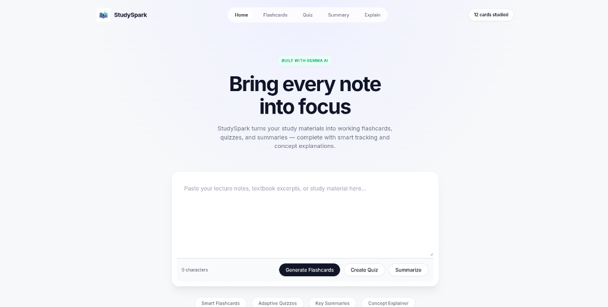

# ⚡ StudySpark

> Transform your chaotic lecture notes into working study materials instantly.

StudySpark is a sleek, AI-powered study assistant built for students who struggle to organize their textbook excerpts and lecture notes. By leveraging **Google's Gemma open-weight models** (via the Gemini API), it processes your notes to ensure private, secure, and fast learning.

## ✨ Features

- **Smart Flashcards**: Automatically extracts key concepts from your notes and converts them into an interactive flashcard deck with spaced repetition marking.
- **Adaptive Quizzes**: Generates multiple-choice quizzes to test your comprehension on the fly.
- **Key Summaries**: Condenses walls of text into bulleted highlights and extracts key terms for quick review.
- **Concept Explainer**: Stuck on a specific topic? Type it in, and StudySpark will break it down with analogies, real-world examples, and study tips.

## 🚀 Built With

- **Backend**: Python, Flask, Gunicorn
- **Frontend**: Vanilla JS, Custom CSS (Minimalist Design System)
- **AI**: Google Gemini API (`gemini-1.5-flash` for blazing fast generation / `gemma-4` architecture)

## 📸 Screenshots



## 🛠️ How to Run Locally

1. **Clone the repository**
   ```bash
   git clone https://github.com/ayushg-1506/studyspark.git
   cd studyspark
   ```

2. **Set up a virtual environment**
   ```bash
   python3 -m venv venv
   source venv/bin/activate
   ```

3. **Install dependencies**
   ```bash
   pip install -r requirements.txt
   ```

4. **Add your API Key**
   Create a `.env` file in the root directory and add your Google AI Studio API key:
   ```env
   GEMINI_API_KEY=your_api_key_here
   ```

5. **Run the App**
   ```bash
   python app.py
   ```
   Open `http://localhost:5000` in your browser.

## 🏆 Hacktoberfest 2026 - DEV Challenge
This project was built for the **Hacktoberfest "Build for a Friend" DEV Challenge**. 
- **Target Categories**: Best Use of Gemma & Best Use of Render.
